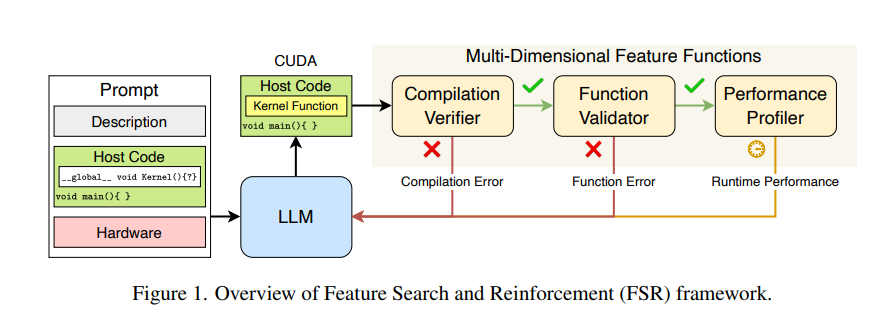
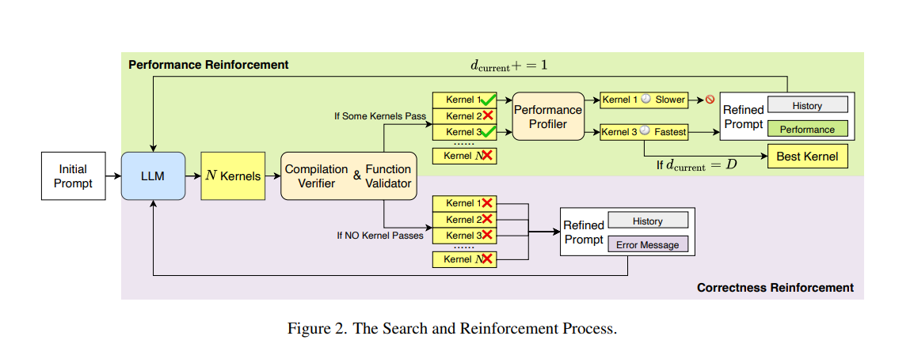

# CUDA-LLM: Feature Search and Reinforcement for LLM-based CUDA Code Generation

Link to the paper : <https://arxiv.org/pdf/2506.09092>

## 1. Motivation of the Paper

To explore how LLMs fare in generating CUDA (Compute Unified Device Architecture) code, which is hardware-based in massively parallel GPUs. To explore the Feature Search and Reinforcement (FSR) framework to overcome the challenges in generating CUDA code.

## 2. Introduction

LLMs have become more capable in reasoning but are still limited in generating CUDA code and kernel designs, which are hardware-based in massively parallel GPUs. Good kernel design depends on hardware specifications, thread and block management, warps, etc. Minor inefficiencies in kernel design and memory management between host and device can lead to performance drops at scale.

To tackle this and help LLMs generate CUDA code, FSR (Feature Search and Reinforcement) is implemented to optimize LLMs for CUDA code generation.

FSR combines feature search and reinforcement to jointly target two critical objectives:

1. **Functional correctness**, verified through test cases
2. **Runtime performance**, measured by empirical execution latency on target GPUs

FSR showed improvements in correctness and performance.

## 3. CUDA Kernels

CUDA is a parallel computing platform and programming model made by NVIDIA to tap into the parallelism of GPGPUs.

A typical CUDA application follows a heterogeneous computing model, where the CPU (host) manages control flow, memory allocation, and data transfer, while the GPU (device) handles data-parallel computation. The distinction between host and device code is fundamental to CUDA design. Functions that run on the GPU are known as kernels, marked with the `__global__` qualifier and launched from the host using the special `<<>>` syntax. Kernels execute in parallel across thousands of lightweight GPU threads, which are organized hierarchically into thread blocks and grids.

For practice codes of CUDA, please refer to tutorials 8-13 ([https://github.com/harshithb3304/HPC](https://github.com/harshithb3304/HPC)).

## 4. Multi-Dimensional FSR Framework

FSR operates by iteratively executing, evaluating, and optimizing LLMs for CUDA code generation. It operates on multi-prompt paradigms which consist of:

- Natural Language
- Host Code for context
- GPU Specifications

FSR then generates the CUDA code which passes through feature functions that assess:

- **Compilation Correctness (Compilation Verifier):** Free from syntax and compilation errors
- **Function Correctness (Function Validator):** Matches the output with test cases
- **Performance Efficiency (Performance Profiler):** Measures runtime performance

Through this iterative loop of generation, evaluation, and reinforcement, FSR effectively bridges the gap between natural language intent and hardware-optimized CUDA code synthesis.

### 
*Figure 1. Overview of Feature Search and Reinforcement (FSR) framework.*

### Search and Reinforcement

After the kernel code passes through the three feature functions, based on the feedback and evaluation, the LLM is optimized to generate CUDA kernels iteratively.

#### Algorithm

- **Initial Kernel Generation:** Initially, the Large Language Model (LLM) generates N candidate CUDA kernels from an initial prompt.
- **Sequential Correctness Evaluation:** Each of these N candidates is sequentially evaluated by two correctness checking modules:
    - The Compilation Verifier
    - The Function Validator
- **Handling Correctness Failures:** If none of the candidates pass both correctness checks (Compilation Verifier and Function Validator):
    - The FSR framework constructs a new prompt.
    - This new prompt incorporates the current kernel code, the corresponding error messages, and the interaction history with the LLM.
    - This refined prompt is then used to generate a new set of N candidate kernels.
    - This process repeats until at least one candidate successfully compiles and produces correct output.
- **Performance Optimization:** Once valid kernels (those that passed both correctness checks) are found:
    - They are passed to the Performance Profiler, which measures their execution speed on the GPU.
    - The fastest kernel among these valid candidates is selected.
    - Its code, along with an associated performance-optimized prompt and dialogue history, forms a new prompt for the next round of LLM generation.
- **Iterative Refinement:** This cycle of correctness verification and performance optimization continues.
- **Termination and Final Output:** The process continues until a predefined depth D is reached. The kernel with the highest execution efficiency at the final iteration is returned as the final output of the FSR framework.

FSR tries to ensure correctness and optimize performance.

### 
*Figure 2. The Search and Reinforcement Process.*

## 5. Evaluation

Two parameters:
- **Correctness**
- **Runtime Latency**

DeepSeek-V3-0324 was used.

**Benchmarks:** 20 widely-used GPU kernel functions

**Setup:**
- **Edge Platform:** NVIDIA GeForce GTX 1660 SUPER GPU with the Turing architecture. This setup reflects a resource-constrained edge computing environment.
- **Server Platform:** NVIDIA GeForce RTX 3090 Ti GPU with the Ada Lovelace architecture. This high-end configuration represents a server-grade computing environment with ample computational and memory resources.

Huge speedups in a wide range of tasks were observed on both GPUs.

## 6. Conclusion

FSR, by integrating feature search and reinforcement refinement, helps LLMs to generate better and understand CUDA code and architecture. There is huge scope for CUDA-LLM to actually help developers to generate kernels.
