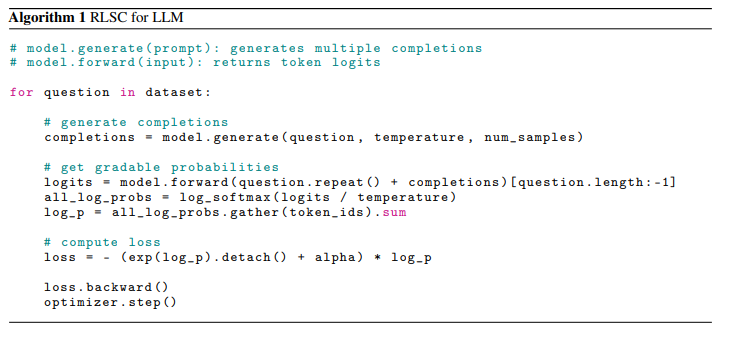
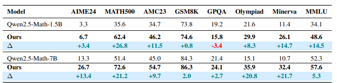

Link to the paper : <https://arxiv.org/pdf/2506.06395> 
# 1. Motive of paper :

Align LLMs behavior with task goals.  
Existing RL depends on human tagging or external reward system.  
To introduce RL with Self Confidence of the LLM. (RLSC)

---

# 2. Introduction :

DPO (Direct Policy Optimization), RLHF( RL with Human Feedback), PPO, [GRPO](https://medium.com/data-science-in-your-pocket/what-is-grpo-the-rl-algorithm-used-to-train-deepseek-12acc19798d3)(Group Relative Policy Optimization) improved reasoning through rewards. Even thought reasoning improved still heavily dependent on reward functions and human labels.  
To tackle this RLSC which gets score from LLM itself. It is believed that Internal Knowledge of LLM + Self Confidence of output can lead to improvements.  
Tested and verified on Qwen model and light datasets.  
Low compute cost + Minimal training data == useful for resource constrained settings

---

# 3. Method:

TTRL (Test Time RL) has a voting mechanism (out of 64 responses) and decides the majority. This is similar to selecting the mode of the responses. So instead of relying on the Probability function for this pseudo labelling Mode sharpening is done by directly using the maximized probability function (Self confidence objective).  
Loss function is derived by apply gradient to the Self Confidence Objective function. A positive constant α is added to introduce additive smoothing which in turn stabilizes the optimization when p is peak or sparse. It helps in better generalization and convergence of the models responses.  
The training is as follows:

a. • For each question, generate 16 completions using generate(temperature = 0.5, num of samples=16)  

b. For each (prompt + answer) pair, tokenize and compute token-level log-probabilities  

c. Apply an assistant mask to isolate only the answer tokens (Refer Transformers Paper + Slides for masking)  

d. Evaluate the sum of the masked log-probs to obtain the log-likelihood of the response  

e. Evaluate the loss and update model parameters via backpropagation  

ALGORITHM

---

# 4. Results Analysis

The above process was tested on variety of standard Mathematical datasets.  
Accuracy is defined as the ratio of correctly answered samples to the total number of evaluation samples.  
Pass@1 score is computed as (1/k) Σ pi.  
The base model + the fine tuned model was compared with same settings and a considerable improvement was seen.  
The fine tuned model prevented the step by step reasoning method such as "Let's Think step by step" but instead found the answer early on and gave the response with confidence and short.  
There were substantial accuracy gains on the dataset in the fine tuned model compared to base model.

---

# 5. Conclusion

RLSC is a lightweight solution to prevent the overhead of human intervention or reward functions and further testing for a larger dataset is to be done.

