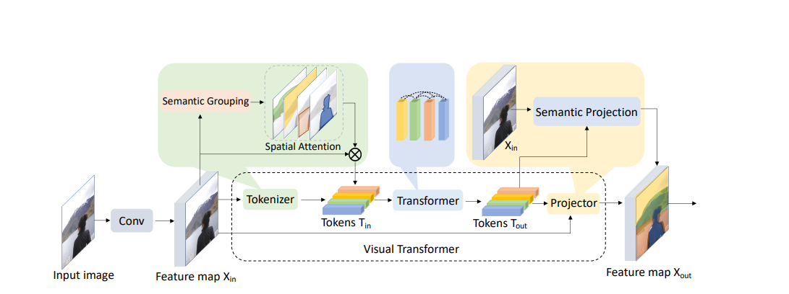
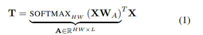
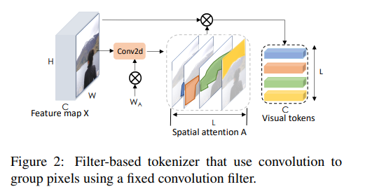
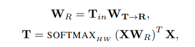
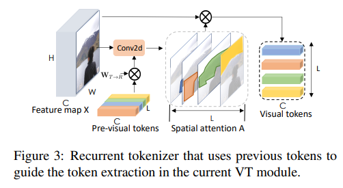

# Visual Transformer 

Link to the paper: <https://arxiv.org/pdf/2006.03677>

# Motivation 

Computer vision has achieved great success till date by representing images as pixels and convolving highly localized features. However convolution treats all image pixels equally regardless of relevance and struggle to relate spacially distant concepts. To challenge this Visual Transformers is proposed. 

# Introduction 

Though convolutions are the standard for image processing there are three challenges 
1. Not all pixels are created equal -> Leads to spacial inefficiency in computation and representation
2. Not all Images have all concepts -> Low level features (corners edges etc ) exist in all images but high level features such as ears only exist in animal photos not in plants hence inefficent filters and time waste.
3. Convolutions struggle to relate spatially distant concepts 

To address the above challenges more precisely pixel-convolution paradigm VT is introduced. 
Intuition : Some tokens are enough to represent high level concepts hence moving from fixed pixel array representation instead spatial attention is used to convert the feature map into compact set of semantic tokens which are then passed to transformer which will eventually be used for classification or spatially reprojected to feature map for segmentation tasks. 

For validation experiments were done by replacing convolution layers to VT in ResNet and redesign feature pyramid networks(FPN). Higher accuracy was observed with less computation in both the tasks. 

# Visual Transformer 

1. Early in the network, use convolutions to learn densely-distributed, low-level patterns.
2. Later in the network, use VTs to learn and relate more sparsely-distributed, higher-order semantic concepts
3. At the end of the network, use visual tokens for imagelevel prediction tasks and use the augmented feature map
for pixel-level prediction tasks

VT Module involves three steps : 
1. Group pixels into semantic concepts to produce a compact set of visual tokens. 
2. Apply transformer to model relations between semantic concepts. 
3. Project these visual tokens back to the pixel space to obtain augmented feature map. 

## Tokenizer 

Intuition is an image can be summarized by a handful of words instead of hundreds of filters or nodes in convolutions or graph convolutions respectively. The input image feature map of HxWxC -> Visual Tokens (L x C) where L << HW (L represents number of tokens). 

### Filter Based Tokenizer 

Uses convolutions to extract visual tokens. For feature map X each pixel Xp is mapped to one of the L semantic groups using point wise convolutions. Then within each group the pixels are spacially pooled to obtain tokens T. 

*Drawback: Fixed filters may waste computation by modeling many high-level concepts that are sparse and not present in every image.*

### Recurrent Tokenizer

To fix the drawback of filter based tokenizer a recurrent tokenizer with weights that are dependent on the previous layer visual tokens. The previous layer tokens guides the extractions of new tokens for the current layer. 

## Transformer

Graph convolutions use fixed weights, so each token is tied to a specific concept, wasting computation on rare concepts. In contrast, transformers use input-dependent weights, allowing visual tokens to represent variable concepts and cover more possibilities with fewer tokens.

## Projections

Many vision tasks need pixel-level details, which are lost in visual tokens. To address this, the transformer's output is fused with the feature map to refine and restore the pixel-array representation.

# Using VT in vision models

Visual Transformers (VTs) can replace convolutional layers in vision models to improve efficiency and performance. For image classification, VT modules are used in place of the last stage of ResNet backbones, reducing computation by operating on a small set of visual tokens instead of all pixels. For semantic segmentation, VTs replace convolutions in feature pyramid networks (FPN), extracting and merging visual tokens across resolutions with a transformer. This approach greatly reduces FLOPs and computational cost while maintaining or improving accuracy.
Respectively the experiments were conducted and huge improvements in accuracy + reduced computation was observed.

# Conclusion
Visual Transformers (VTs) introduce a new paradigm in computer vision by representing images with high-level visual tokens and using transformers to model their relationships, rather than relying on pixel arrays and convolutions. This approach leads to significant improvements in accuracy and efficiency across various tasks, as demonstrated by higher ImageNet and segmentation scores with much lower computational cost. 

Personal opinion: VT's shift from pixel-level processing to concept-level reasoning is a promising direction for the field. By reducing redundancy and focusing on meaningful features, VTs not only improve performance but also open up new possibilities for more efficient and interpretable vision models.
