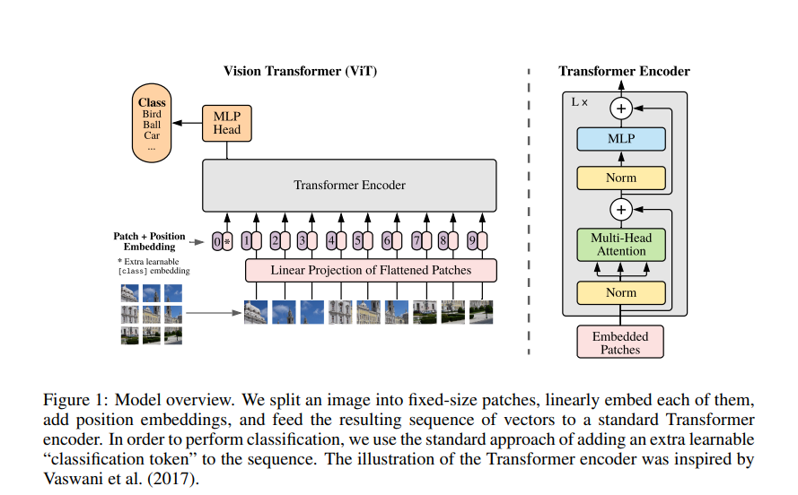

# Vision Transformer (ViT)

Link to the paper: <https://arxiv.org/pdf/2010.11929>

## 1. Motive of the Paper

Transformers revolutionized NLP with their self-attention mechanism, becoming the backbone for many language tasks. However, in Computer Vision (CV), Convolutional Neural Networks (CNNs) remained dominant. The core motivation behind ViT was to investigate whether a pure Transformer architecture could be directly applied to sequences of image patches for image classification, without relying on convolutions. The idea was to split an image into fixed-size patches (e.g., 16x16 pixels), treat each patch as a "token" (like words in NLP), and train a Transformer on these patches.

## 2. Why ViT Didn't Work Immediately for Mid-Level Datasets

Initially, ViT did not outperform CNNs on mid-sized datasets. This is mainly because Transformers lack the inductive biases of CNNs, such as translation equivariance and locality. Without these biases, Transformers require much more data to generalize well, and thus do not perform as strongly when trained on limited data.

## 3. Method: How ViT Works

ViT adapts the standard Transformer architecture from NLP to images with minimal changes:

- Images are divided into fixed-size patches (e.g., 16x16).
- Each patch is flattened and mapped to a latent vector (patch embedding) via a linear projection.
- Position embeddings are added to retain spatial information. These 1D position embeddings learn to encode the 2D structure of the image.
- A learnable classification token (like BERT's [class] token) is prepended to the sequence. The output of this token is used for classification.
- The sequence (patch embeddings + position embeddings + class token) is fed into a standard Transformer encoder, which consists of alternating layers of multi-headed self-attention (MSA) and MLP blocks, with LayerNorm before and residual connections after each block.

## 4. Key Discoveries & Performance

- ViT shows significant improvements when pre-trained on large datasets (e.g., ImageNet-21k, JFT-300M).
- With large-scale pre-training, ViT matches or outperforms state-of-the-art CNNs on image recognition benchmarks.
- Large-scale training compensates for the lack of strong inductive biases.
- ViT models are more memory-efficient than ResNets for large batch sizes.
- The self-attention mechanism allows ViT to integrate information across the entire image from the earliest layers, similar to the receptive field in CNNs but with global scope.

## 5. Challenges and Future Directions

- Applying ViT to other vision tasks (e.g., object detection, segmentation) remains a challenge.
- Further research is needed on self-supervised pre-training for ViT, as initial results lag behind large-scale supervised pre-training.
- Scaling up ViT models is likely to yield further performance gains.
